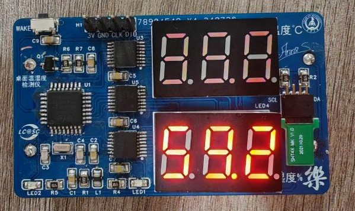
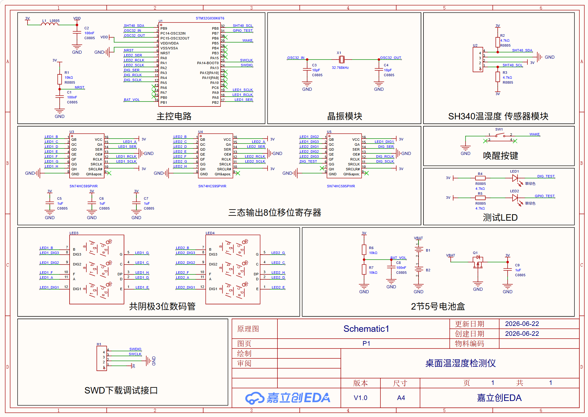
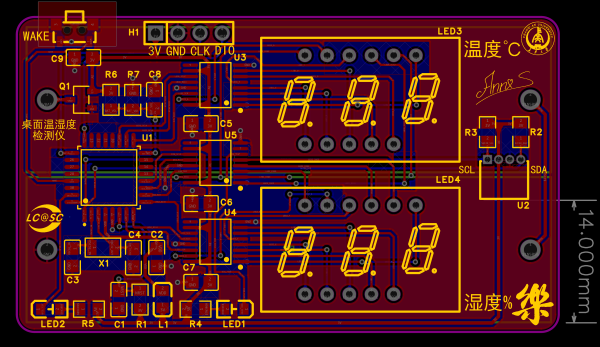
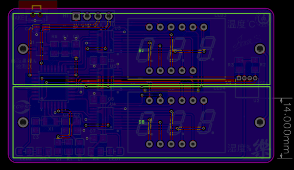
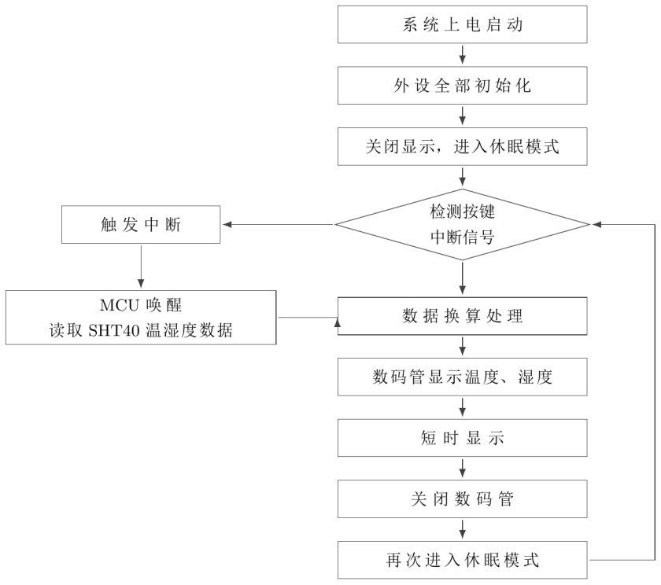

# STM32 低功耗桌面温湿度检测仪

单片机与嵌入式系统课程设计。项目由小组共同完成，本人担任组长。小组基于嘉立创公开课程方案完成板级制作、固件整合与功能联调，实现按键唤醒、温湿度采集、数码管动态显示和自动休眠。

**个人分工：**

- 负责任务分配，完成原理图与 PCB 设计。
- 整合按键唤醒、温湿度采集、分时显示和自动休眠流程。
- 参与贴片焊接、程序烧录和整机功能调试。

## 功能与方案

<!-- 单片机演示视频：首次推送后替换为 GitHub user-attachments 链接 -->

  

按下唤醒键后，主控通过 I2C 读取 SHT40，两组三位数码管分别显示温度和湿度；显示结束后关闭数码管并重新进入休眠。

- 主控：STM32G030K6T6，Cortex-M0+，64 MHz 系统时钟。
- 传感器：SHT40，使用 I2C1 读取温湿度数据。
- 显示：SN74HC595 驱动两组三位数码管，TIM14 定时中断完成动态扫描。
- 唤醒：PB5 上拉输入，下降沿外部中断唤醒。
- 低功耗：空闲时暂停 SysTick 并进入 Sleep，唤醒后恢复系统节拍。

> [!NOTE]
> 项目实现了休眠与唤醒流程，但未进行待机电流和电池续航的定量测试，因此不将续航时间作为实测结果。

## 原理图与 PCB

  

  
  

主控和显示驱动集中在左侧，SHT40 放置在 PCB 右侧边缘，减少主控与数码管发热对测量的影响。

## 软件流程与工程

  

- [完整 CubeMX / Keil 工程](温湿度检测仪_完整工程.zip)

完整工程使用 STM32CubeMX 6.10.0、STM32Cube FW_G0 V1.6.2 和 MDK-ARM V5.32，解压后可用 Keil 打开 `MDK-ARM/Project.uvprojx`。
