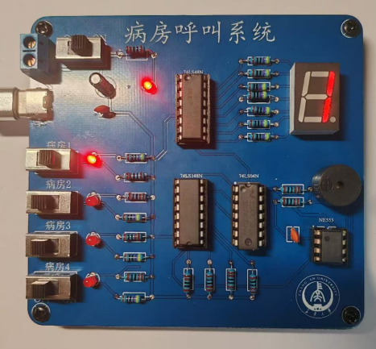
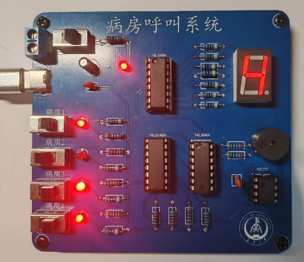
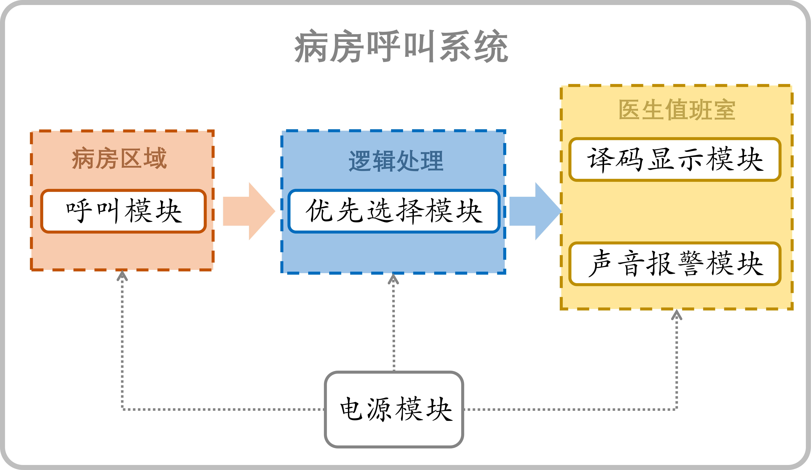
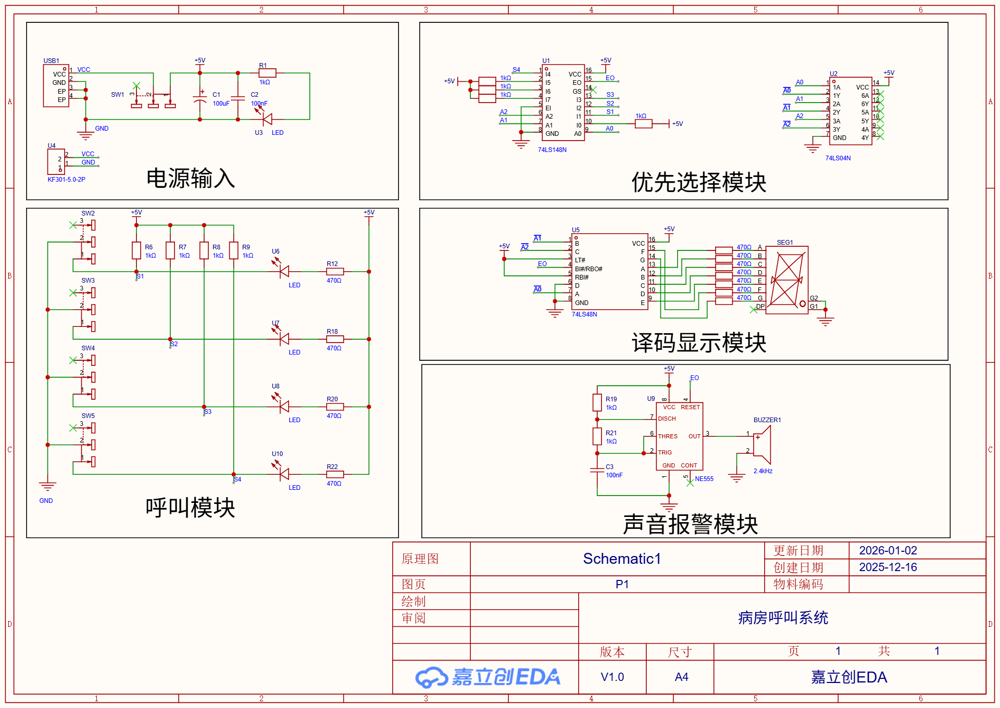
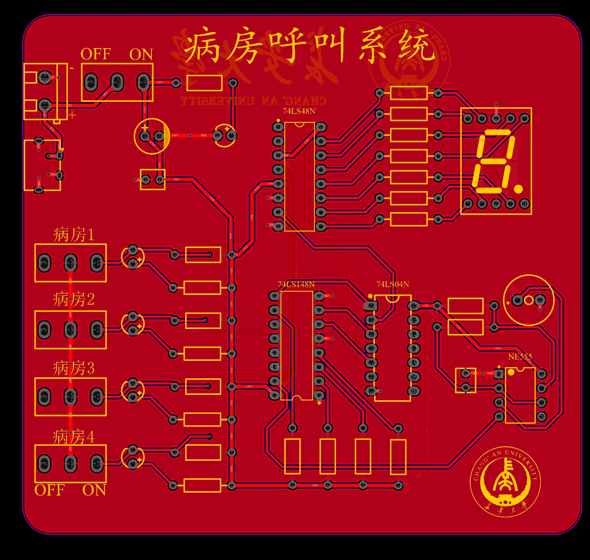
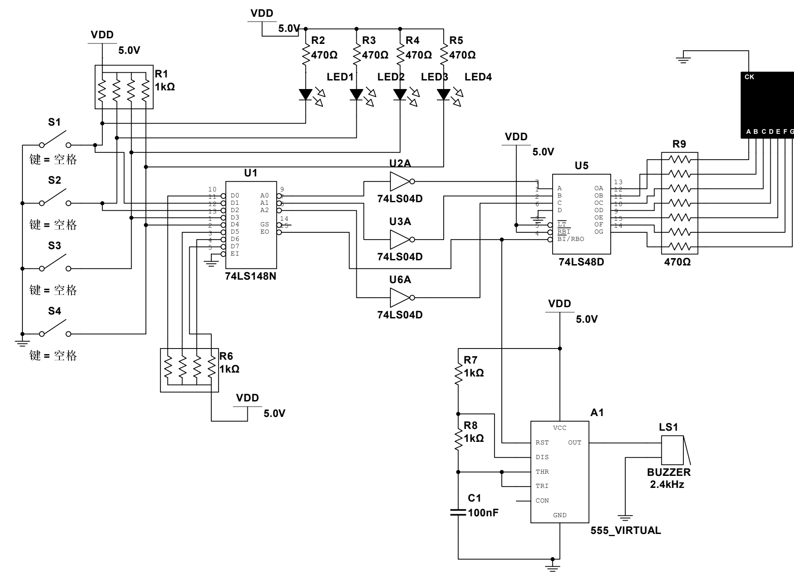

# 四路病房呼叫系统

电子线路综合实践课程设计。项目由小组共同完成，本人担任组长。系统使用 74 系列逻辑芯片和 NE555，实现四路病床呼叫、多路优先级判断、编号显示和声光报警。

**个人分工：**

- 完成译码显示模块的逻辑设计、Multisim 仿真与联调。
- 完成嘉立创 EDA 原理图和双层 PCB 设计。
- 参与板卡焊接、上电检查和整机调试。

## 功能与实现

https://github.com/user-attachments/assets/15b0ec4c-efe0-41f8-b06e-ffc62143de57

按下病床开关后，对应 LED 点亮，数码管显示病床编号，蜂鸣器发出报警。多路同时呼叫时，74LS148N 选择并显示当前最高优先级编号。

  
  

  

- 呼叫输入：4 路开关，低电平有效。
- 优先选择：74LS148N 对多路呼叫进行优先编码。
- 译码显示：74LS04N 反相，74LS48N 驱动共阴极七段数码管。
- 声音报警：NE555 多谐振荡器驱动无源蜂鸣器。
- 系统供电：充电宝经 Type-C 接口提供 +5 V 电源。

## 设计与仿真

  

  

  

仿真验证了呼叫输入、优先编码、数码管译码显示和蜂鸣报警链路。

- [嘉立创 EDA 工程](病房呼叫系统_嘉立创EDA.epro2)
- [Multisim 仿真工程](病房呼叫系统_Multisim.ms14)

## 复刻注意

> [!CAUTION]
> **制板前请重新核对 C1 极性。** 课设制板时曾将电解电容 C1 的 PCB 极性画反，到焊接阶段才发现并处理。目前不确定所有导出内容是否均已修正，制板和上电前应自行核对原理图、PCB 封装、丝印与实物正负极。

> [!NOTE]
> **C3 容值会影响蜂鸣器音调。** 实际购买的 C3 与设计值偏差较大，导致实物报警声偏尖锐。复刻时可测量 C3 实际容值，再根据 NE555 振荡频率和听感调整 C3 或相关 RC 参数。
